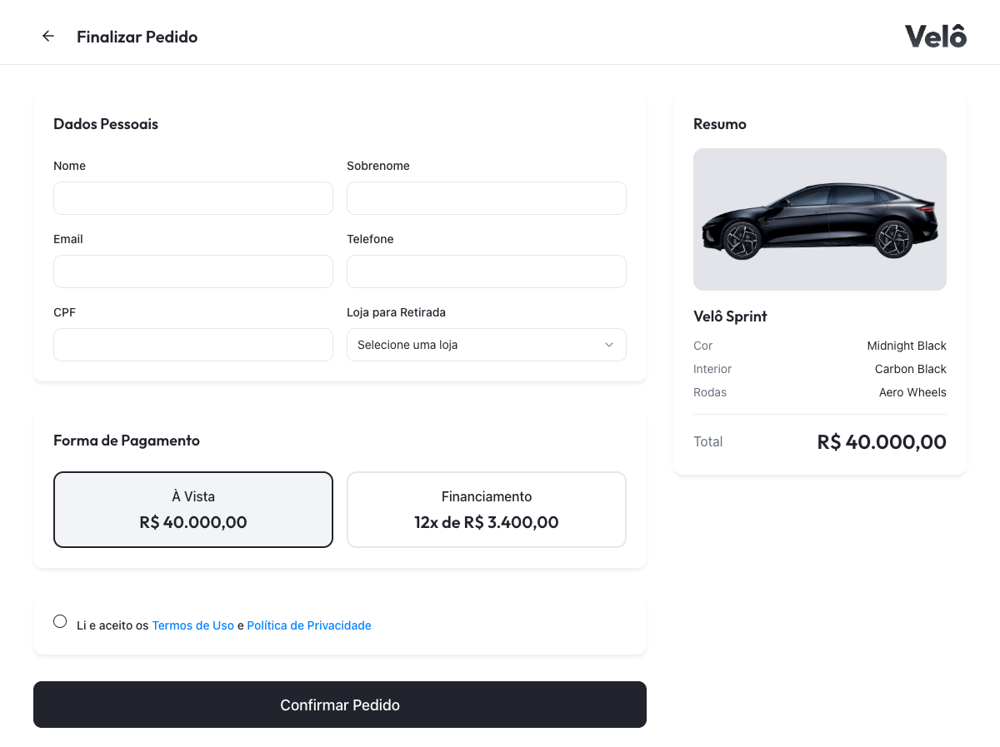

# Relatorio de Execucao - CT02 e CT03 (Playwright MCP)

## Contexto
- **Sistema:** Velô Sprint
- **Ambiente:** `http://localhost:5173`
- **Data:** 2026-04-21
- **Executor:** Playwright MCP (`user-playwright`)
- **Base de referencia:** `docs/tests/test-cases.md`

## Resumo Executivo
- **CT02 (Cores + Rodas + Preco):** Aprovado
- **CT03 (Opcionais + Preco + Checkout):** Aprovado
- **Resultado geral:** Fluxo do configurador consistente com os criterios esperados para variacao de preco e navegacao para checkout.

## CT02 - Evidencias e Resultado

### Validacoes realizadas
1. Preco inicial exibido em `R$ 40.000,00`.
2. Alteracao de cor para **Midnight Black** sem alterar o preco (`R$ 40.000,00`).
3. Selecao da roda **Sport Wheels** com atualizacao para `R$ 42.000,00`.
4. Retorno para **Aero Wheels** com preco voltando para `R$ 40.000,00`.

### Evidencias visuais
1. Estado inicial (preco base):  
   
2. Cor alterada para Midnight Black (preco mantido):  
   
3. Rodas Sport selecionadas (preco +2000):  
   
4. Retorno para Aero (preco base):  
   

### Status CT02
- **Aprovado**.

## CT03 - Evidencias e Resultado

### Validacoes realizadas
1. Marcacao dos opcionais **Precision Park** e **Flux Capacitor** com preco em `R$ 50.500,00`.
2. Desmarcacao dos opcionais com retorno do preco para `R$ 40.000,00`.
3. Clique em **Monte o Seu** e redirecionamento para `http://localhost:5173/order`.
4. Persistencia validada no checkout com configuracao e total coerentes.

### Evidencias visuais
1. Opcionais marcados (preco acumulado):  
    
2. Opcionais desmarcados (retorno preco base):  
   
3. Checkout em `/order` apos clicar em "Monte o Seu":  
   

### Status CT03
- **Aprovado**.

## Observacoes Tecnicas
- Durante acesso ao checkout, foram exibidos avisos de deprecacao (`findDOMNode` em StrictMode) no console.
- Esses avisos **nao bloquearam** o fluxo funcional dos cenarios CT02 e CT03.

## Conclusao para Gestao
- O comportamento funcional do configurador e do encaminhamento ao checkout esta aderente aos casos de teste CT02 e CT03.
- A experiencia do usuario no fluxo testado manteve consistencia de regras de negocio (preco por rodas e opcionais).
